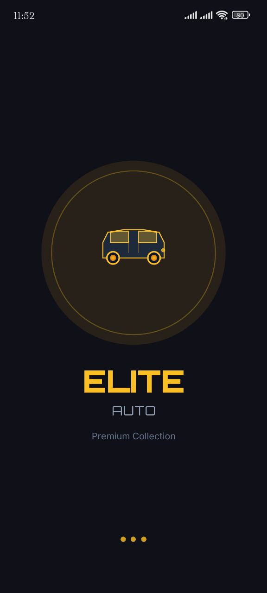
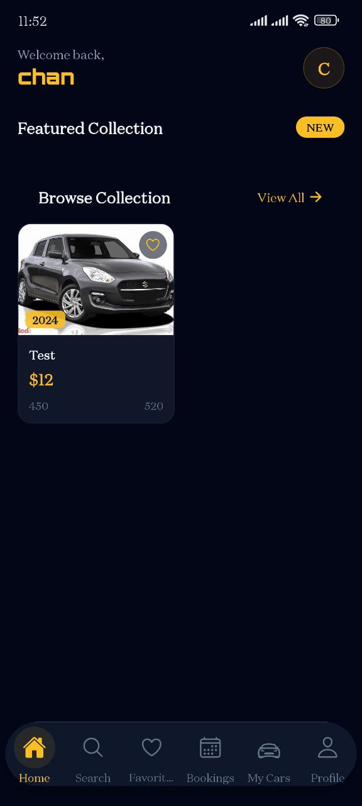
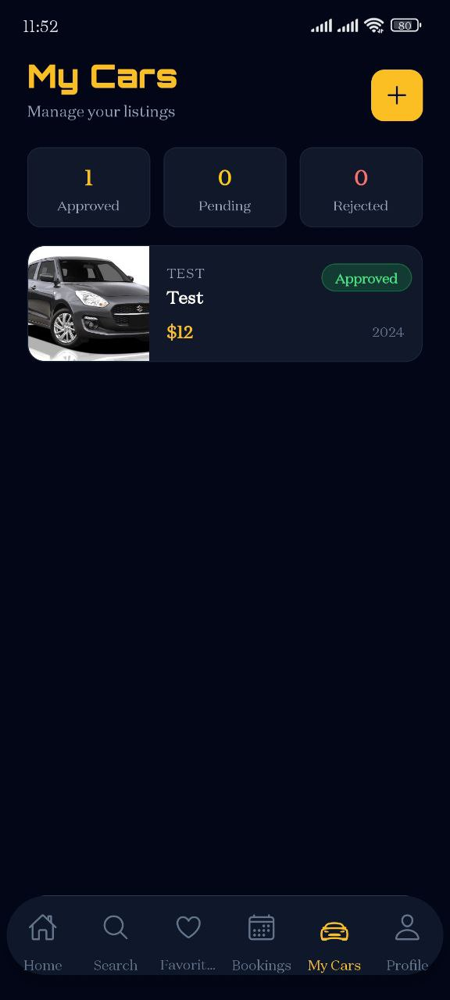

# Elite Auto - Premium Car Showroom App 🚗

A premium mobile car marketplace built with React Native (Expo), featuring real-time notifications, advanced search, appointment booking, and role-based seller/buyer workflows.

## 🌟 Features

### For Buyers

- **Browse Premium Cars** - Explore curated listings with detailed specs and multiple images
- **Advanced Search & Filters** - Find your perfect car by brand, type, fuel, price range
- **Favorites System** - Save cars you love for later viewing
- **Test Drive Booking** - Schedule appointments with sellers directly in-app
- **Real-time Notifications** - Get instant updates when appointments are confirmed
- **Seller Contact** - Direct call/SMS to sellers for inquiries

### For Sellers

- **Seller Dashboard** - Manage all your car listings in one place
- **Multi-Image Upload** - Upload up to 6 high-quality images per listing
- **Appointment Management** - View, confirm, or decline test drive requests
- **Push Notifications** - Get notified of new booking requests immediately
- **Edit & Delete** - Full control over your listings
- **Status Tracking** - Monitor approval status (pending/approved/rejected)

### Admin Features

- Car listing approval workflow
- User role management (buyer/seller)
- Content moderation

## 🛠️ Tech Stack

### Frontend

- **Framework**: React Native (Expo SDK 52)
- **Navigation**: Expo Router (file-based routing)
- **State Management**: Zustand
- **Styling**: NativeWind (Tailwind CSS for React Native)
- **UI Components**: Custom components with Ionicons
- **Fonts**: Orbitron, Inter

### Backend

- **Database**: Supabase (PostgreSQL)
- **Authentication**: Supabase Auth
- **Storage**: Supabase Storage (avatars, car images)
- **Edge Functions**: Supabase Functions (push notifications)
- **Real-time**: Supabase Realtime subscriptions

### Notifications

- **Push Service**: Expo Push Notifications
- **Channels**: Android notification channels
- **Deep Linking**: Navigate to specific screens from notifications

## 📦 Installation

### Prerequisites

- Node.js 18+ and npm/yarn
- Expo CLI
- Android Studio (for Android) or Xcode (for iOS)
- Supabase account

### 1. Clone the repository

```bash
git clone https://github.com/Biak18/Elite-Auto.git
cd elite-auto
```

### 2. Install dependencies

```bash
npm install
```

### 3. Environment Setup

Create a `.env` file in the root directory:

```env
EXPO_PUBLIC_SUPABASE_URL=
EXPO_PUBLIC_SUPABASE_ANON_KEY=
```

### 4. Supabase Setup

#### Run SQL migrations

Execute the SQL files in order:

1. `supabase/migrations/001_initial_schema.sql`
2. `supabase/migrations/002_seller_setup.sql`

#### Deploy Edge Functions

```bash
npm install supabase --save-dev
npx supabase login
npx supabase link --project-ref 12345
npx supabase functions deploy push --no-verify-jwt
```

### 5. Configure Firebase (for Push Notifications)

1. Create a Firebase project
2. Add Android/iOS app in Firebase Console
3. Download `google-services.json` (Android) or `GoogleService-Info.plist` (iOS)
4. Place in respective directories
5. Add service account JSON to `supabase/functions/service-account.json`

### 6. Start the development server

```bash
npx expo start
```

Choose your platform:

- Press `a` for Android emulator
- Press `i` for iOS simulator
- Scan QR code with Expo Go app

## 📱 App Structure

```
chan_car_showroom/
├── app/                          # Expo Router screens
│   ├── (auth)/                   # Authentication screens
|   |   ├── _layout.tsx           # Auth layout (no tabs/header)
│   │   ├── sign-in.tsx           # Sign in screen
│   │   └── sign-up.tsx           # Sign up screen
│   ├── (tabs)/                   # Main app tabs
│   │   ├── _layout.tsx           # Tab navigator layout
│   │   ├── index.tsx             # Home (featured cars)
│   │   ├── search.tsx            # Search & filters
│   │   ├── favorites.tsx         # Saved cars
│   │   ├── appointments.tsx      # Bookings
│   │   ├── seller.tsx            # Seller dashboard
│   │   └── profile.tsx           # User profile
│   ├── appointment/[id].tsx      # Appointment details
│   ├── car/[id].tsx              # Car detail page
│   ├── seller/
│   │   ├── add-car.tsx           # Add new listing
│   │   └── [id].tsx              # Edit listing
│   ├── complete-profile.tsx      # Profile completion
│   ├── edit-profile.tsx          # Edit profile
│   ├── global.css
│   └── _layout.tsx               # Root layout
├── src/
│   ├── components/               # Reusable UI components
│   │   ├── ui/                   # Form fields, buttons, dropdowns
│   │   ├── BookingModal.tsx      # Test drive booking modal
│   │   └── splashscreen/         # Animated splash screen
│   ├── lib/
│   │   ├── api/
│   │   ├── supabase.ts           # Supabase client
│   │   └── utils/                # Helper functions
│   │       ├── dialog.ts         # Alert/confirm dialogs
│   │       ├── formatters.ts     # Price, date formatting
│   │       └── notifications.ts  # Push notification helpers
│   ├── services/                 # API services
│   │   ├── authService.ts        # Authentication
│   │   ├── carService.ts         # Car CRUD
│   │   ├── appointmentService.ts # Booking logic
│   │   ├── favoritesService.ts   # Favorite logic
│   │   └── notificationService.ts# Push notifications
│   ├── store/                    # Zustand state management
│   │   ├── authStore.ts          # User session
│   │   ├── carStore.ts           # Car listings
│   │   ├── favoriteStore.ts      # Favorites
│   │   ├── appointmentStore.ts   # Bookings
│   │   └── uiStore.ts            # UI state (dialogs)
│   ├── types/
│   │   └── interfaces.ts         # TypeScript types
│   └── widgets/
│       └── MessageBox.tsx        # Custom alert dialogs
├── supabase/
│   ├── functions/
│   │   └── push/                 # Push notification edge function
│   └── migrations/               # Database migrations
├── assets/                       # Images, fonts, icons
├── app.json                      # Expo config
└── tailwind.config.js            # NativeWind config
```

## 🗄️ Database Schema

### Tables

- **profiles** - User profiles (buyer/seller info)
- **cars** - Car listings with approval status
- **car_images** - Multiple images per car
- **appointments** - Test drive bookings
- **favorites** - User's saved cars
- **notifications** - Push notification history

### Storage Buckets

- **avatars** - User profile pictures
- **car-images** - Car listing photos

## 🔐 Authentication & Authorization

### Roles

- **Buyer**: Browse, favorite, book test drives
- **Seller**: List cars, manage bookings, respond to buyers
- **Admin**: Approve/reject listings (Supabase dashboard)

### Row Level Security (RLS)

- Buyers see only approved cars
- Sellers see their own cars (any status)
- Users manage their own appointments
- Sellers can view bookings for their cars

## 🔔 Push Notifications

### Triggers

- New booking request (→ Seller)
- Booking confirmed (→ Buyer)
- Booking cancelled (→ Both)
- Booking completed (→ Buyer)
- Car approved/rejected (→ Seller)

### Deep Linking

Tapping a notification navigates to:

- Appointment detail page
- Appointments tab
- Car detail page
- Seller dashboard

## 🎨 Design System

### Colors

- **Primary**: `#020617` (Dark slate)
- **Secondary**: `#0f172a` (Slate)
- **Accent**: `#fbbf24` (Amber/Gold)
- **Text**: White, slate-300, slate-400

### Typography

- **Headings**: Orbitron (premium, tech-inspired)
- **Body**: Inter (clean, readable)

### Components

- Custom form fields with icons
- Premium card designs with glassmorphism
- Smooth animations and transitions
- Native feel with platform-specific behaviors

## 📸 Screenshots



## 🚀 Deployment

### Build for Production

#### Android (APK/AAB)

```bash
eas build --platform android
```

#### iOS (IPA)

```bash
eas build --platform ios
```

### Publish Updates (OTA)

```bash
eas update --branch production
```

## 🧪 Testing

### Test User Accounts

```
Buyer:
- Email: buyer@test.com
- Password: Test123!

Seller:
- Email: seller@test.com
- Password: Test123!
```

## 🐛 Known Issues & Limitations

- Push notifications require physical device (won't work in emulator)
- Image upload limited to 6 per car (storage optimization)
- Appointments don't auto-expire (manual management required)

## 🔮 Future Enhancements

- [ ] In-app chat between buyers and sellers
- [ ] Payment integration for deposits
- [ ] Car comparison tool
- [ ] Advanced analytics for sellers
- [ ] Multi-language support
- [ ] Dark/light mode toggle
- [ ] Social sharing of listings
- [ ] Review and rating system

## 🤝 Contributing

Contributions are welcome! Please follow these steps:

1. Fork the repository
2. Create a feature branch (`git checkout -b feature/amazing-feature`)
3. Commit your changes (`git commit -m 'Add amazing feature'`)
4. Push to the branch (`git push origin feature/amazing-feature`)
5. Open a Pull Request

## 📄 License

This project is licensed under the MIT License - see the [LICENSE](LICENSE) file for details.

## 👨‍💻 Author

**Biak**

- GitHub: [Biak18](https://github.com/Biak18)
- Email: biakceu912@gmail.com

## 🙏 Acknowledgments

- [Expo](https://expo.dev) - Amazing React Native framework
- [Supabase](https://supabase.com) - Backend as a Service
- [NativeWind](https://www.nativewind.dev) - Tailwind for React Native
- [Ionicons](https://ionic.io/ionicons) - Beautiful icon library

---

Made with ❤️ and ☕ by [Biak]
